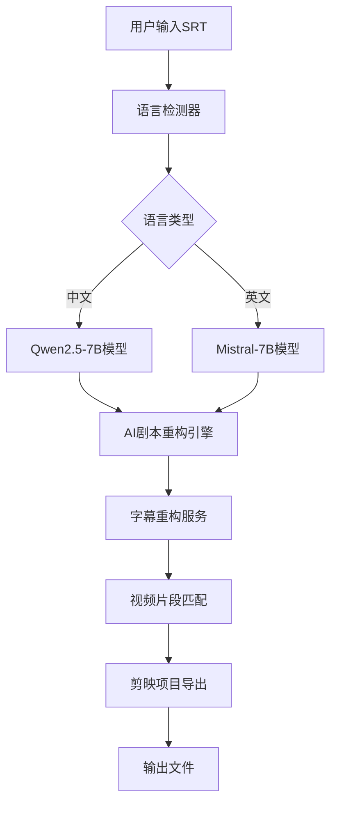

# 🛠️ VisionAI-ClipsMaster 开发者指南

> **代码结构和开发规范 - 为贡献者和开发者准备**

## 📋 项目架构

### 核心模块结构

```
VisionAI-ClipsMaster/
├── src/                          # 源代码目录
│   ├── core/                     # 核心功能模块
│   │   ├── ai_viral_transformer.py      # AI剧本重构引擎
│   │   ├── language_detector.py         # 语言检测器
│   │   ├── jianying_exporter.py        # 剪映导出器
│   │   ├── enhanced_model_downloader.py # 智能模型下载器
│   │   ├── video_processor.py          # 视频处理器
│   │   └── subtitle_reconstructor.py   # 字幕重构服务
│   ├── ui/                       # 用户界面组件
│   │   ├── main_window.py              # 主窗口
│   │   ├── training_panel.py           # 训练面板
│   │   ├── progress_dashboard.py       # 进度仪表板
│   │   ├── enhanced_download_dialog.py # 下载对话框
│   │   └── theme_switcher.py           # 主题切换器
│   ├── exporters/                # 导出功能模块
│   │   ├── jianying_pro_exporter.py    # 剪映专业版导出
│   │   ├── fcpxml_exporter.py          # Final Cut Pro导出
│   │   └── premiere_exporter.py        # Premiere Pro导出
│   ├── training/                 # 训练系统模块
│   │   ├── data_augment.py             # 数据增强
│   │   ├── plot_augment.py             # 剧情增强
│   │   ├── en_trainer.py               # 英文模型训练器
│   │   └── zh_trainer.py               # 中文模型训练器
│   └── utils/                    # 工具函数
│       ├── memory_manager.py           # 内存管理器
│       ├── performance_optimizer.py    # 性能优化器
│       ├── error_handler.py            # 错误处理器
│       └── config_manager.py           # 配置管理器
├── tests/                        # 测试套件
├── configs/                      # 配置文件
├── tools/                        # 外部工具
├── docs/                         # 文档目录
└── requirements.txt              # Python依赖
```

### 数据流架构



## 🔧 开发环境设置

### 开发依赖安装

```bash
# 克隆开发分支
git clone -b develop https://github.com/CKEN-STAR/VisionAI-ClipsMaster.git
cd VisionAI-ClipsMaster

# 创建开发环境
python -m venv dev_env
source dev_env/bin/activate  # Linux/macOS
# 或 dev_env\Scripts\activate  # Windows

# 安装开发依赖
pip install -r requirements.txt
pip install -r requirements_test.txt

# 安装预提交钩子
pre-commit install
```

### 开发工具配置

#### VS Code配置 (.vscode/settings.json)
```json
{
    "python.defaultInterpreterPath": "./dev_env/bin/python",
    "python.linting.enabled": true,
    "python.linting.pylintEnabled": true,
    "python.formatting.provider": "black",
    "python.testing.pytestEnabled": true,
    "python.testing.pytestArgs": ["tests/"],
    "files.exclude": {
        "**/__pycache__": true,
        "**/*.pyc": true
    }
}
```

#### PyCharm配置
```
1. 设置Python解释器为 ./dev_env/bin/python
2. 启用代码检查: Pylint, Black, isort
3. 配置测试运行器: pytest
4. 设置代码模板和Live Templates
```

## 📝 编码规范

### Python代码风格

#### 基本规范
```python
# 使用Black格式化器
# 行长度限制: 88字符
# 使用类型提示

from typing import List, Dict, Optional, Union
import logging

logger = logging.getLogger(__name__)

class ExampleClass:
    """示例类，展示编码规范。
    
    Attributes:
        name: 类名称
        config: 配置字典
    """
    
    def __init__(self, name: str, config: Optional[Dict] = None) -> None:
        self.name = name
        self.config = config or {}
        
    def process_data(self, data: List[str]) -> Dict[str, int]:
        """处理数据并返回统计结果。
        
        Args:
            data: 输入数据列表
            
        Returns:
            包含统计信息的字典
            
        Raises:
            ValueError: 当数据为空时抛出
        """
        if not data:
            raise ValueError("数据不能为空")
            
        result = {}
        for item in data:
            result[item] = len(item)
            
        logger.info(f"处理了 {len(data)} 个数据项")
        return result
```

#### 命名约定
```python
# 类名: PascalCase
class VideoProcessor:
    pass

# 函数和变量: snake_case
def process_subtitle_file():
    file_path = "example.srt"
    
# 常量: UPPER_SNAKE_CASE
MAX_MEMORY_USAGE = 400  # MB
DEFAULT_MODEL_NAME = "qwen2.5-7b"

# 私有成员: 前缀下划线
class ModelLoader:
    def __init__(self):
        self._model = None
        self.__private_key = "secret"
```

### 文档字符串规范

```python
def ai_reconstruct_subtitle(
    original_srt: str, 
    target_language: str = "zh",
    intensity: float = 0.8
) -> Dict[str, Any]:
    """AI驱动的字幕重构功能。
    
    将原始字幕转换为更具吸引力的短剧版本，保持原意的同时
    增加戏剧性和观众参与度。
    
    Args:
        original_srt: 原始SRT字幕文件路径
        target_language: 目标语言代码 ("zh", "en")
        intensity: 重构强度，范围0.0-1.0，默认0.8
        
    Returns:
        包含重构结果的字典:
        {
            "reconstructed_srt": "重构后的字幕内容",
            "segments": [{"start": 0.0, "end": 5.0, "text": "..."}],
            "metadata": {"original_length": 100, "new_length": 85}
        }
        
    Raises:
        FileNotFoundError: 当SRT文件不存在时
        ValueError: 当intensity参数超出范围时
        ModelNotLoadedError: 当AI模型未正确加载时
        
    Example:
        >>> result = ai_reconstruct_subtitle("input.srt", "zh", 0.9)
        >>> print(f"重构完成，生成 {len(result['segments'])} 个片段")
    """
    pass
```

## 🧪 测试指南

### 测试结构

```
tests/
├── unit/                         # 单元测试
│   ├── test_core/               # 核心模块测试
│   │   ├── test_ai_transformer.py
│   │   ├── test_language_detector.py
│   │   └── test_jianying_exporter.py
│   ├── test_ui/                 # UI组件测试
│   └── test_utils/              # 工具函数测试
├── integration/                  # 集成测试
│   ├── test_full_workflow.py
│   └── test_export_pipeline.py
├── performance/                  # 性能测试
│   ├── test_memory_usage.py
│   └── test_startup_time.py
└── fixtures/                     # 测试数据
    ├── sample_subtitles/
    └── expected_outputs/
```

### 编写测试

#### 单元测试示例
```python
import pytest
from unittest.mock import Mock, patch
from src.core.language_detector import LanguageDetector

class TestLanguageDetector:
    """语言检测器测试类。"""
    
    @pytest.fixture
    def detector(self):
        """创建语言检测器实例。"""
        return LanguageDetector()
    
    def test_detect_chinese(self, detector):
        """测试中文检测功能。"""
        text = "这是一段中文字幕内容"
        result = detector.detect(text)
        
        assert result["language"] == "zh"
        assert result["confidence"] > 0.9
        
    def test_detect_english(self, detector):
        """测试英文检测功能。"""
        text = "This is an English subtitle content"
        result = detector.detect(text)
        
        assert result["language"] == "en"
        assert result["confidence"] > 0.9
        
    @patch('src.core.language_detector.langdetect')
    def test_fallback_detection(self, mock_langdetect, detector):
        """测试备用检测机制。"""
        mock_langdetect.detect.side_effect = Exception("Library not available")
        
        text = "测试文本"
        result = detector.detect(text)
        
        # 应该使用备用检测方法
        assert result["language"] in ["zh", "en"]
        assert "fallback" in result["method"]
```

#### 集成测试示例
```python
import pytest
import tempfile
from pathlib import Path
from src.core.ai_viral_transformer import AIViralTransformer

class TestFullWorkflow:
    """完整工作流程集成测试。"""
    
    @pytest.fixture
    def sample_srt_file(self):
        """创建示例SRT文件。"""
        content = """1
00:00:01,000 --> 00:00:05,000
这是第一段字幕

2
00:00:06,000 --> 00:00:10,000
这是第二段字幕
"""
        with tempfile.NamedTemporaryFile(mode='w', suffix='.srt', delete=False) as f:
            f.write(content)
            return f.name
    
    def test_complete_reconstruction_workflow(self, sample_srt_file):
        """测试完整的字幕重构工作流程。"""
        transformer = AIViralTransformer()
        
        # 执行重构
        result = transformer.reconstruct_from_file(sample_srt_file)
        
        # 验证结果
        assert "reconstructed_srt" in result
        assert "segments" in result
        assert len(result["segments"]) >= 2
        
        # 验证时间轴保持
        for segment in result["segments"]:
            assert "start" in segment
            assert "end" in segment
            assert segment["start"] < segment["end"]
        
        # 清理
        Path(sample_srt_file).unlink()
```

### 运行测试

```bash
# 运行所有测试
pytest

# 运行特定测试文件
pytest tests/unit/test_core/test_language_detector.py

# 运行带覆盖率报告的测试
pytest --cov=src --cov-report=html

# 运行性能测试
pytest tests/performance/ -v

# 运行标记的测试
pytest -m "not slow"  # 跳过慢速测试
```

## 🚀 性能优化

### 内存优化策略

#### 内存监控
```python
import psutil
import gc
from typing import Dict

class MemoryMonitor:
    """内存使用监控器。"""
    
    def __init__(self, max_memory_mb: int = 400):
        self.max_memory_mb = max_memory_mb
        self.process = psutil.Process()
    
    def get_memory_usage(self) -> Dict[str, float]:
        """获取当前内存使用情况。"""
        memory_info = self.process.memory_info()
        return {
            "rss_mb": memory_info.rss / 1024 / 1024,
            "vms_mb": memory_info.vms / 1024 / 1024,
            "percent": self.process.memory_percent()
        }
    
    def check_memory_limit(self) -> bool:
        """检查是否超出内存限制。"""
        usage = self.get_memory_usage()
        if usage["rss_mb"] > self.max_memory_mb:
            self.cleanup_memory()
            return False
        return True
    
    def cleanup_memory(self):
        """清理内存。"""
        gc.collect()
        # 清理模型缓存
        if hasattr(self, '_model_cache'):
            self._model_cache.clear()
```

#### 延迟加载
```python
class LazyModelLoader:
    """延迟加载模型管理器。"""
    
    def __init__(self):
        self._models = {}
        self._loaded_models = set()
    
    def register_model(self, name: str, loader_func):
        """注册模型加载函数。"""
        self._models[name] = loader_func
    
    def get_model(self, name: str):
        """获取模型，需要时才加载。"""
        if name not in self._loaded_models:
            model = self._models[name]()
            self._loaded_models.add(name)
            return model
        return self._models[name]
```

### 启动时间优化

#### 模块预编译
```python
import py_compile
import os
from pathlib import Path

def precompile_modules():
    """预编译Python模块以加速启动。"""
    src_dir = Path("src")
    
    for py_file in src_dir.rglob("*.py"):
        try:
            py_compile.compile(py_file, doraise=True)
            print(f"预编译完成: {py_file}")
        except py_compile.PyCompileError as e:
            print(f"预编译失败: {py_file}, 错误: {e}")

if __name__ == "__main__":
    precompile_modules()
```

#### 智能缓存
```python
import pickle
import hashlib
from pathlib import Path
from typing import Any, Optional

class SmartCache:
    """智能缓存系统。"""
    
    def __init__(self, cache_dir: str = ".cache"):
        self.cache_dir = Path(cache_dir)
        self.cache_dir.mkdir(exist_ok=True)
    
    def _get_cache_key(self, data: Any) -> str:
        """生成缓存键。"""
        data_str = str(data).encode('utf-8')
        return hashlib.md5(data_str).hexdigest()
    
    def get(self, key: str) -> Optional[Any]:
        """从缓存获取数据。"""
        cache_file = self.cache_dir / f"{key}.pkl"
        if cache_file.exists():
            try:
                with open(cache_file, 'rb') as f:
                    return pickle.load(f)
            except Exception:
                cache_file.unlink()  # 删除损坏的缓存
        return None
    
    def set(self, key: str, value: Any):
        """设置缓存数据。"""
        cache_file = self.cache_dir / f"{key}.pkl"
        with open(cache_file, 'wb') as f:
            pickle.dump(value, f)
```

## 🔄 贡献流程

### Git工作流程

#### 分支策略
```
master    - 生产稳定版本
develop   - 开发主分支
feature/* - 功能开发分支
hotfix/*  - 紧急修复分支
release/* - 发布准备分支
```

#### 提交规范
```bash
# 提交消息格式
<type>(<scope>): <subject>

<body>

<footer>

# 示例
feat(core): 添加AI剧本重构功能

- 实现基于Transformer的字幕重构
- 支持中英文双语处理
- 添加重构强度参数控制

Closes #123
```

#### 提交类型
```
feat:     新功能
fix:      Bug修复
docs:     文档更新
style:    代码格式调整
refactor: 代码重构
test:     测试相关
chore:    构建过程或辅助工具的变动
perf:     性能优化
```

### 代码审查清单

#### 功能审查
- [ ] 功能是否按需求正确实现
- [ ] 是否有充分的测试覆盖
- [ ] 是否处理了边界情况
- [ ] 错误处理是否完善
- [ ] 性能是否满足要求

#### 代码质量审查
- [ ] 代码风格是否符合规范
- [ ] 变量和函数命名是否清晰
- [ ] 是否有适当的注释和文档
- [ ] 是否遵循DRY原则
- [ ] 是否有代码重复

#### 安全审查
- [ ] 是否有安全漏洞
- [ ] 输入验证是否充分
- [ ] 是否正确处理敏感数据
- [ ] 依赖库是否安全

## 📦 发布流程

### 版本号规范

使用语义化版本控制 (SemVer):
```
MAJOR.MINOR.PATCH

MAJOR: 不兼容的API修改
MINOR: 向后兼容的功能性新增
PATCH: 向后兼容的问题修正
```

### 发布检查清单

#### 发布前检查
- [ ] 所有测试通过
- [ ] 代码覆盖率 ≥ 90%
- [ ] 性能基准测试通过
- [ ] 文档更新完成
- [ ] 变更日志更新

#### 发布步骤
```bash
# 1. 更新版本号
echo "1.2.0" > VERSION

# 2. 更新变更日志
# 编辑 CHANGELOG.md

# 3. 提交版本更新
git add VERSION CHANGELOG.md
git commit -m "chore: bump version to 1.2.0"

# 4. 创建标签
git tag -a v1.2.0 -m "Release version 1.2.0"

# 5. 推送到远程
git push origin develop
git push origin v1.2.0

# 6. 创建发布
# 在GitHub上创建Release
```

## 📞 获取帮助

### 开发者资源
- **架构文档**: docs/architecture/
- **API文档**: docs/api/
- **代码示例**: examples/
- **开发者讨论**: GitHub Discussions

### 联系方式
- **技术问题**: 创建GitHub Issue
- **功能建议**: GitHub Discussions
- **安全问题**: 私信项目维护者

---

**欢迎贡献！** 让我们一起构建更好的AI驱动短剧混剪工具！🚀
