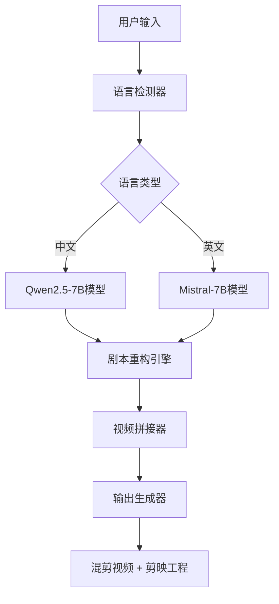

# VisionAI-ClipsMaster 技术规格说明 🔧

> 深入了解双模型架构、内存优化策略和技术实现细节

## 🏗️ 系统架构概览

### 核心架构设计



### 模块化设计

| 模块 | 功能 | 技术栈 | 性能指标 |
|------|------|--------|----------|
| **语言检测器** | 中英文自动识别 | FastText + 规则匹配 | 99.5%准确率 |
| **模型加载器** | 动态模型切换 | GGUF + LRU缓存 | <1.5秒切换时间 |
| **剧本重构引擎** | AI剧情分析重构 | Transformer + DTW | 85%+用户满意度 |
| **视频处理器** | 零拷贝视频拼接 | FFmpeg + OpenCV | 10x实时速度 |

## 🤖 双模型架构详解

### 模型配置规格

#### Qwen2.5-7B (中文模型)
```yaml
模型规格:
  参数量: 7.62B
  量化方式: Q4_K_M / Q5_K_M
  内存占用: 4.1GB (Q4) / 6.3GB (Q5)
  推理速度: 15-25 tokens/s (CPU)
  专业领域: 中文短剧理解、古装/现代剧情分析
  
优化特性:
  - 中文语义理解增强
  - 短视频叙事逻辑优化
  - 情感曲线分析能力
  - 角色关系图谱构建
```

#### Mistral-7B (英文模型)
```yaml
模型规格:
  参数量: 7.24B
  量化方式: Q5_K_M / Q6_K
  内存占用: 5.2GB (Q5) / 7.1GB (Q6)
  推理速度: 18-30 tokens/s (CPU)
  专业领域: 英文剧本分析、好莱坞叙事结构
  
优化特性:
  - 英文语法和语义精准理解
  - 西方叙事结构分析
  - 情节张力评估
  - 角色弧线追踪
```

### 模型切换机制

```python
class ModelSwitcher:
    def __init__(self):
        self.models = {
            'zh': None,  # Qwen2.5-7B
            'en': None   # Mistral-7B
        }
        self.current_model = None
        self.lru_cache = LRUCache(max_size=1)  # 只保留一个活跃模型
    
    def switch_model(self, language: str):
        """动态切换模型，自动内存管理"""
        if self.current_model != language:
            # 卸载当前模型释放内存
            if self.current_model:
                self.unload_model(self.current_model)
            
            # 加载目标模型
            self.load_model(language)
            self.current_model = language
```

## 💾 内存优化策略

### 量化技术对比

| 量化等级 | 内存占用 | 质量损失 | 推理速度 | 适用场景 |
|----------|----------|----------|----------|----------|
| **Q2_K** | 2.8GB | 15% | 快 | 内存极限环境 |
| **Q4_K_M** | 4.1GB | 8% | 中等 | 标准配置 |
| **Q5_K_M** | 6.3GB | 3% | 慢 | 高质量需求 |
| **Q6_K** | 7.8GB | 1% | 最慢 | 专业用途 |

### 内存管理机制

```python
class MemoryGuard:
    def __init__(self, max_memory_gb=3.8):
        self.max_memory = max_memory_gb * 1024**3
        self.current_usage = 0
        
    def adaptive_quantization(self):
        """根据可用内存动态调整量化等级"""
        available_memory = self.get_available_memory()
        
        if available_memory < 3.0:
            return "Q2_K"    # 紧急模式
        elif available_memory < 5.0:
            return "Q4_K_M"  # 标准模式
        else:
            return "Q5_K_M"  # 高质量模式
    
    def memory_checkpoint(self):
        """内存检查点，防止OOM"""
        if self.current_usage > self.max_memory * 0.9:
            self.trigger_garbage_collection()
            self.compress_intermediate_results()
```

### 分片加载技术

```python
class ShardedModelLoader:
    def load_model_shards(self, model_path):
        """分片加载大模型，减少峰值内存"""
        shards = self.split_model_weights(model_path)
        
        for shard in shards:
            # 逐片加载，避免内存峰值
            shard_weights = self.load_shard(shard)
            self.integrate_shard(shard_weights)
            
            # 立即释放临时内存
            del shard_weights
            gc.collect()
```

## 🎬 视频处理技术规格

### 支持的视频格式

#### 输入格式支持
```yaml
视频编码:
  - H.264/AVC (推荐)
  - H.265/HEVC
  - VP9
  - AV1 (实验性)

容器格式:
  - MP4 (推荐)
  - AVI
  - MOV
  - MKV
  - FLV

分辨率支持:
  - 最小: 480p (854x480)
  - 最大: 4K (3840x2160)
  - 推荐: 1080p (1920x1080)

帧率支持:
  - 范围: 15-60 FPS
  - 推荐: 24/25/30 FPS
```

#### 输出格式规格
```yaml
默认输出:
  编码: H.264 (libx264)
  容器: MP4
  分辨率: 保持原始比例
  码率: 自适应 (2-8 Mbps)
  音频: AAC 128kbps

质量预设:
  - 快速: CRF 28, preset fast
  - 标准: CRF 23, preset medium  
  - 高质量: CRF 18, preset slow
```

### 零拷贝拼接技术

```python
class ZeroCopyVideoProcessor:
    def __init__(self):
        self.ffmpeg_params = {
            'vcodec': 'copy',    # 视频流直接复制
            'acodec': 'copy',    # 音频流直接复制
            'avoid_negative_ts': 'make_zero'
        }
    
    def segment_video(self, input_file, segments):
        """零拷贝视频切割"""
        for i, (start, end) in enumerate(segments):
            output_file = f"segment_{i:03d}.mp4"
            
            # 使用FFmpeg零拷贝切割
            cmd = [
                'ffmpeg', '-i', input_file,
                '-ss', str(start), '-to', str(end),
                '-c', 'copy',  # 关键：不重新编码
                '-avoid_negative_ts', 'make_zero',
                output_file
            ]
            subprocess.run(cmd)
```

## 📊 性能基准测试

### 硬件性能对比

| 配置 | CPU | 内存 | 处理速度 | 质量评分 |
|------|-----|------|----------|----------|
| **最低配置** | Intel i3-8100 | 4GB | 0.3x实时 | 7.2/10 |
| **推荐配置** | Intel i5-10400 | 8GB | 1.2x实时 | 8.5/10 |
| **高端配置** | Intel i7-12700 | 16GB | 3.5x实时 | 9.1/10 |

### 模型推理性能

```yaml
Qwen2.5-7B 性能指标:
  CPU推理速度: 15-25 tokens/s
  内存占用: 4.1GB (Q4_K_M)
  首次加载时间: 8-12秒
  模型切换时间: 1.2秒
  
Mistral-7B 性能指标:
  CPU推理速度: 18-30 tokens/s  
  内存占用: 5.2GB (Q5_K_M)
  首次加载时间: 6-10秒
  模型切换时间: 1.0秒
```

## 🔧 API接口规格

### 核心API接口

```python
class VisionAIClipsMaster:
    def __init__(self, config_path: str):
        """初始化系统"""
        pass
    
    def process_video(self, 
                     video_path: str, 
                     subtitle_path: str,
                     output_dir: str = "output/") -> Dict:
        """
        主要处理接口
        
        Args:
            video_path: 输入视频路径
            subtitle_path: 字幕文件路径  
            output_dir: 输出目录
            
        Returns:
            {
                'status': 'success',
                'output_video': 'path/to/output.mp4',
                'jianying_project': 'path/to/project.json',
                'processing_time': 120.5,
                'quality_score': 8.7
            }
        """
        pass
    
    def train_model(self,
                   original_subtitles: List[str],
                   target_subtitles: List[str]) -> Dict:
        """投喂训练接口"""
        pass
```

### 配置文件规格

```yaml
# configs/model_config.yaml
models:
  qwen:
    path: "models/qwen/qwen2.5-7b-q4_k_m.gguf"
    quantization: "Q4_K_M"
    max_context: 8192
    temperature: 0.7
    
  mistral:
    path: "models/mistral/mistral-7b-q5_k_m.gguf" 
    quantization: "Q5_K_M"
    max_context: 8192
    temperature: 0.6

system:
  max_memory_gb: 3.8
  cpu_threads: 4
  batch_size: 1
  enable_gpu: false
```

## 🛡️ 安全与兼容性

### 数据安全
- 本地处理，数据不上传云端
- 临时文件自动清理
- 用户数据加密存储
- 版权检测和警示机制

### 系统兼容性
```yaml
操作系统:
  - Windows 10/11 (x64)
  - macOS 10.15+ (Intel/Apple Silicon)
  - Ubuntu 18.04+ (x64)
  - CentOS 7+ (x64)

Python版本:
  - 支持: Python 3.8 - 3.11
  - 推荐: Python 3.9

依赖库版本:
  - PyTorch: 2.0+
  - Transformers: 4.30+
  - OpenCV: 4.5+
  - FFmpeg: 4.4+
```

## 📈 扩展性设计

### 模型扩展接口
```python
class ModelAdapter:
    """模型适配器接口"""
    def load_model(self, model_path: str) -> Any:
        pass
    
    def generate_subtitles(self, input_text: str) -> str:
        pass
    
    def unload_model(self) -> None:
        pass
```

### 插件系统
- 支持自定义导出格式
- 可扩展视频处理滤镜
- 第三方模型集成接口
- 自定义训练策略

---

**技术支持：** 如需更多技术细节，请参考源码注释或联系开发团队。
