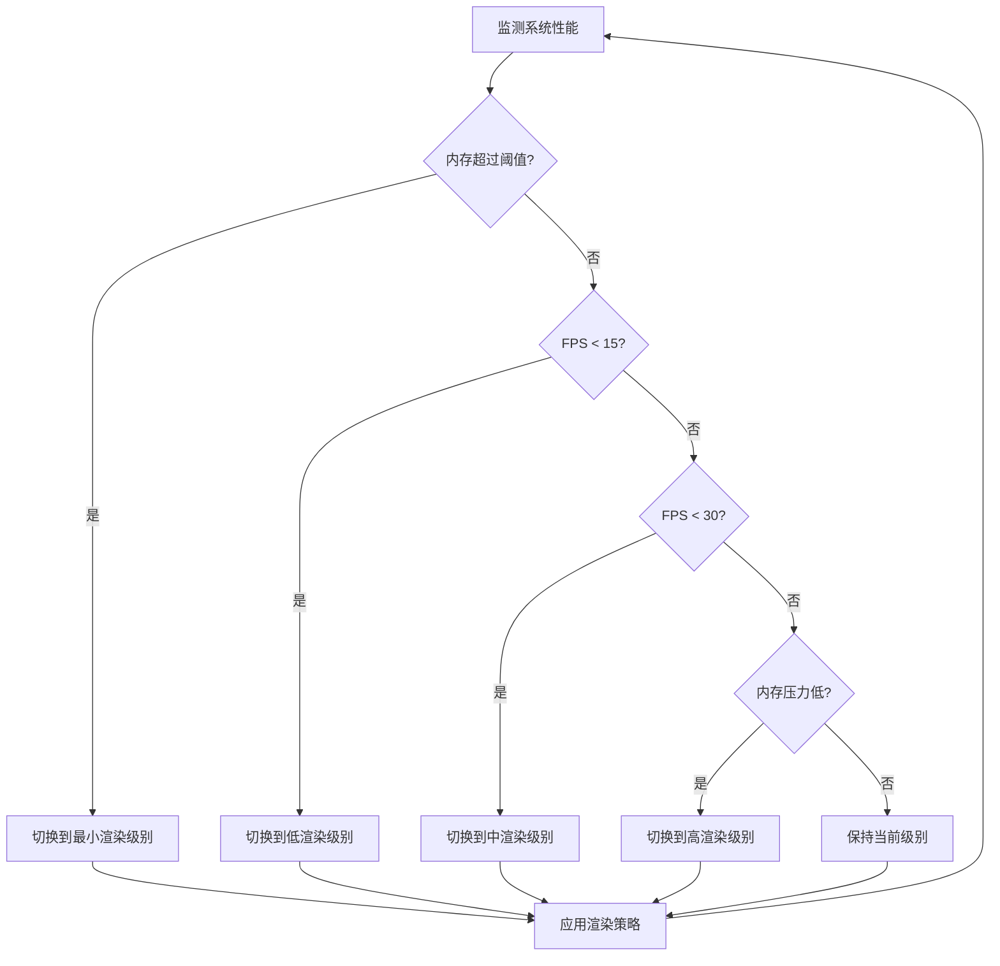

# 自适应渲染优化

## 简介

VisionAI-ClipsMaster系统引入了自适应渲染优化机制，可根据系统性能自动调整UI渲染参数，特别针对4GB低内存环境进行了优化，确保在各种硬件条件下保持流畅体验。

## 核心功能

- **细节级别自动调整**：根据FPS和内存压力动态切换高、中、低、最小四个细节级别
- **智能数据采样**：根据当前渲染级别自动采样数据，减少渲染负载
- **动画效果智能切换**：在低性能环境下自动禁用动画效果，减少渲染压力
- **更新频率自适应**：根据系统性能动态调整UI更新频率
- **内存压力保护**：在内存接近阈值时，自动切换到最低渲染级别，保护系统稳定性

## 实现架构

### 1. 渲染细节级别

系统支持四个渲染级别，每个级别对应不同的渲染策略：

| 细节级别 | 采样率 | 动画效果 | 更新间隔 | 纹理质量 | 抗锯齿 |
|---------|-------|---------|---------|---------|-------|
| 高       | 100%  | 启用    | 0.05秒  | 高      | 启用  |
| 中       | 80%   | 启用    | 0.1秒   | 中      | 启用  |
| 低       | 50%   | 禁用    | 0.5秒   | 低      | 禁用  |
| 最小     | 30%   | 禁用    | 2.0秒   | 低      | 禁用  |

### 2. 自动优化逻辑

### 3. 性能监控指标

- **FPS**：帧率，决定渲染流畅度
- **内存使用**：监控内存压力，避免OOM风险
- **渲染时间**：单帧渲染耗时
- **数据规模**：当前渲染数据量

## 集成组件

自适应渲染优化已集成到以下组件中：

1. **时空态势感知视图 (SpacetimeView)**
   - 3D可视化组件自动采样
   - 根据性能动态调整更新频率

2. **黄金指标仪表盘 (GoldenMetricPanel)**
   - 指标图表动态渲染
   - 智能控制动画刷新率

3. **关联分析面板 (CorrelationPanel)**
   - 智能控制关联图谱渲染细节
   - 大数据集自动采样显示

4. **主窗口 (MainWindow)**
   - 全局渲染参数控制
   - 性能监控指示器

## 优化效果

在不同环境下的优化效果：

- **4GB内存环境**：
  - 优化前：大量数据渲染时出现卡顿、延迟，甚至崩溃
  - 优化后：自动降低渲染细节，保持UI响应，防止OOM

- **8GB内存环境**：
  - 优化前：中等数据量渲染时偶有卡顿
  - 优化后：根据负载智能调整，保持流畅体验

- **16GB内存环境**：
  - 充分利用硬件性能，提供最佳视觉体验

## 配置与使用

### 自动/手动模式切换

系统支持自动优化和手动设置两种模式：

- **自动模式**：系统根据性能指标自动调整渲染参数
- **手动模式**：用户可通过UI控制固定渲染级别

### 全局渲染控制

主窗口提供全局渲染质量控制，允许用户根据需要调整渲染策略：

- 通过菜单：工具 -> 渲染优化
- 通过状态栏：渲染质量指示器

## 工作原理

1. **性能监控**：
   - 系统持续监控FPS、内存使用情况
   - 维护性能指标历史记录，避免频繁切换

2. **智能采样**：
   - 根据当前渲染级别对数据进行线性采样
   - 保持数据分布特征，降低渲染负担

3. **自适应更新**：
   - 根据系统性能动态调整UI更新间隔
   - 在性能受限环境下，降低更新频率

4. **渲染级别切换**：
   - 根据性能表现平滑切换渲染级别
   - 优先保证UI响应性和系统稳定性

## 测试与验证

使用自定义测试工具验证了不同场景下的优化表现：

- **正常场景**：稳定高FPS下的正常渲染
- **压力测试**：内存压力逐渐增加的场景
- **波动场景**：FPS大幅波动的情况
- **性能衰退**：系统性能逐渐下降的情况

测试结果表明，渲染优化器能够有效应对各种性能挑战，保持系统稳定性。

## 结论

自适应渲染优化是VisionAI-ClipsMaster系统在低资源环境下保持可用性的关键技术。通过智能调整渲染参数，系统能够在各种硬件条件下提供流畅的用户体验，特别是在4GB低内存环境中，有效避免了OOM风险，确保系统稳定运行。 