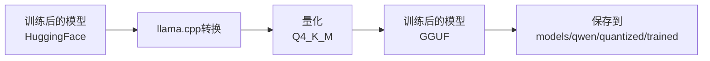
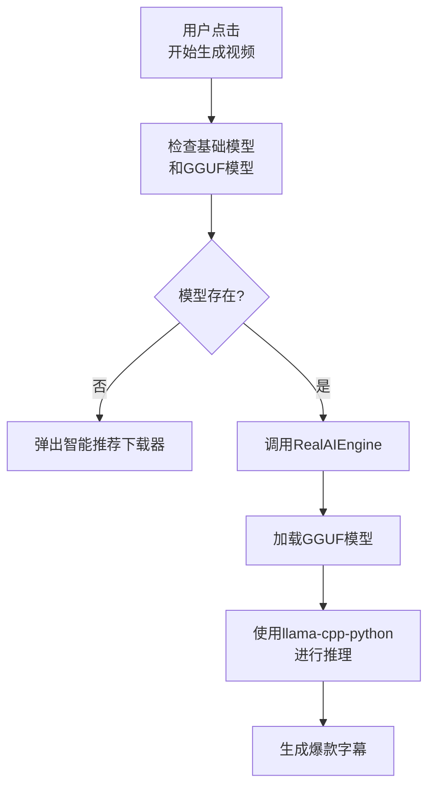

# VisionAI-ClipsMaster 双轨道设计详解

> **基于实际代码分析** - 不依赖文档，完全基于代码实现

---

## 📋 目录

1. [核心概念](#核心概念)
2. [轨道1：HuggingFace格式（训练轨道）](#轨道1huggingface格式训练轨道)
3. [轨道2：GGUF格式（推理轨道）](#轨道2gguf格式推理轨道)
4. [完整工作流程](#完整工作流程)
5. [视频处理时的模型加载](#视频处理时的模型加载)
6. [模型选择优先级](#模型选择优先级)
7. [配置问题与修复建议](#配置问题与修复建议)
8. [总结与建议](#总结与建议)

---

## 核心概念

**双轨道设计**指的是项目中同时支持两种模型格式，分别用于不同的场景：

| 轨道 | 格式 | 用途 | 库支持 | 文件大小 | 推理速度 |
|------|------|------|--------|----------|----------|
| **轨道1** | HuggingFace | 训练和微调 | `transformers` + `torch` | 2-3GB | 慢 |
| **轨道2** | GGUF | 推理生成 | `llama-cpp-python` | 几百MB-2GB | 快 |

### 为什么需要双轨道？

1. **训练需求**：HuggingFace格式支持完整的训练功能（LoRA微调）
2. **推理效率**：GGUF格式推理速度快3-5倍，内存占用减少50-75%
3. **灵活性**：可以根据需求选择不同的格式
4. **兼容性**：支持两种主流的模型格式

---

## 轨道1：HuggingFace格式（训练轨道）

### 目录结构

```
models/
├── qwen/
│   ├── base/              # 基础模型（HuggingFace格式）
│   │   ├── config.json
│   │   ├── model.safetensors
│   │   ├── tokenizer.json
│   │   └── ...
│   └── finetuned/         # 训练后的模型（HuggingFace格式）
│       ├── adapter_config.json
│       ├── adapter_model.safetensors
│       ├── training_config.json
│       └── ...
└── mistral/
    ├── base/              # 基础模型（HuggingFace格式）
    └── finetuned/         # 训练后的模型（HuggingFace格式）
```

### 用途

- ✅ 用于模型训练和微调
- ✅ 使用 `transformers` 库进行LoRA微调
- ✅ 训练完成后保存到 `finetuned` 目录
- ❌ **不推荐用于推理**（速度慢，内存占用大）

### 特点

| 特性 | 说明 |
|------|------|
| 文件大小 | 2-3GB（完整模型权重） |
| 依赖库 | `transformers`, `torch`, `peft` |
| 训练支持 | ✅ 完整支持LoRA微调 |
| 推理速度 | ⚠️ 较慢 |
| 内存占用 | ⚠️ 较大（3-4GB+） |

### 代码位置

- **训练器**：`src/training/model_fine_tuner.py`
- **配置**：第90-117行
  ```python
  "models": {
      "zh": {
          "base_model": "Qwen/Qwen2.5-1.5B-Instruct",
          "model_path": "models/qwen2.5-1.5b/fp16",
          "output_dir": "models/qwen/finetuned"  # 训练输出目录
      }
  }
  ```

### 训练流程

```
基础模型（HuggingFace）
    ↓
  加载模型和Tokenizer
    ↓
  配置LoRA适配器
    ↓
  准备训练数据
    ↓
  执行训练
    ↓
训练后的模型（HuggingFace）
保存到 models/qwen/finetuned
```

**关键代码**（`src/training/model_fine_tuner.py` 第273-285行）：
```python
# 保存模型
output_dir = self.config["models"][language]["output_dir"]
os.makedirs(output_dir, exist_ok=True)

trainer.save_model(output_dir)
tokenizer.save_pretrained(output_dir)

# 保存训练配置
config_path = os.path.join(output_dir, "training_config.json")
with open(config_path, 'w', encoding='utf-8') as f:
    json.dump(training_config, f, ensure_ascii=False, indent=2)
```

---

## 轨道2：GGUF格式（推理轨道）

### 目录结构

```
models/
├── qwen/
│   ├── quantized/         # 基础GGUF模型
│   │   ├── Q4_K_M.gguf   # 量化后的基础模型
│   │   └── trained/       # 训练后的GGUF模型
│   │       └── latest.gguf
│   └── gguf/              # 其他GGUF模型
└── mistral/
    ├── quantized/         # 基础GGUF模型
    │   └── Q4_K_M.gguf
    └── gguf/
```

### 用途

- ✅ 用于推理（生成爆款字幕）
- ✅ 使用 `llama-cpp-python` 库加载
- ✅ 量化后的模型，占用内存更小
- ✅ **专门用于推理，推荐用于视频处理**

### 特点

| 特性 | 说明 |
|------|------|
| 文件大小 | 几百MB-2GB（量化后） |
| 依赖库 | `llama-cpp-python` |
| 训练支持 | ❌ 不支持训练 |
| 推理速度 | ✅ 快3-5倍 |
| 内存占用 | ✅ 节省50-75% |
| 量化级别 | Q4_K_M（推荐）, Q5_K, Q8_0 |

### 代码位置

- **推理引擎**：`src/core/real_ai_engine.py`
- **GGUF加载**：第151-180行
  ```python
  def _load_gguf_model(self, model_config: Dict[str, Any]) -> Optional[Any]:
      """加载GGUF格式模型"""
      model_path = model_config["path"]
      
      llama_config = {
          "model_path": model_path,
          "n_ctx": model_config.get("max_tokens", 2048),
          "n_threads": os.cpu_count() or 4,
          "verbose": False
      }
      
      model = Llama(**llama_config)
      return model
  ```

### 转换流程

```
训练后的模型（HuggingFace）
    ↓
  llama.cpp/convert_hf_to_gguf.py
    ↓
  量化（Q4_K_M, Q5_K, Q8_0）
    ↓
训练后的模型（GGUF）
保存到 models/qwen/quantized/trained/latest.gguf
```

**转换工具**：`models/converters/model_converter.py`

**关键代码**（第71-103行）：
```python
def _convert_to_gguf(self, model_path: str, output_path: str, quant_type: str) -> str:
    """Convert to GGUF format with specified quantization"""
    
    # 使用llama.cpp的量化工具
    convert_script = Path("llama.cpp/convert_hf_to_gguf.py")
    
    cmd = [
        "python",
        str(convert_script),
        model_path,
        "--outfile", output_path,
        "--outtype", quant_mapping[quant_type]
    ]
    
    subprocess.run(cmd, check=True)
    return output_path
```

---

## 完整工作流程

### 1️⃣ 训练阶段（使用HuggingFace格式）


**代码位置**：`src/training/model_fine_tuner.py`

### 2️⃣ 转换阶段（HuggingFace → GGUF）



**代码位置**：`models/converters/model_converter.py`

### 3️⃣ 推理阶段（使用GGUF格式）



**代码位置**：`src/core/real_ai_engine.py`

---

## 视频处理时的模型加载

### 完整调用链

```
用户点击"开始生成视频"
    ↓
simple_ui_fixed.py: generate_video() (第10709-10777行)
    ↓
检查基础模型和GGUF模型 (第10715-10760行)
    ↓
VideoProcessor.generate_viral_srt() (第2583-2711行)
    ↓
ui_bridge.generate_viral_srt() (第45-85行)
    ↓
ScreenplayEngineer.generate_viral_screenplay()
    ↓
RealAIEngine.generate_viral_subtitle() (第272-304行)
    ↓
RealAIEngine.switch_model() (第227-251行)
    ↓
RealAIEngine.load_model() (第106-149行)
    ↓
RealAIEngine._load_gguf_model() (第151-180行)
    ↓
使用llama-cpp-python加载GGUF模型
    ↓
RealAIEngine._generate_response() (第368-418行)
    ↓
生成爆款字幕
```

### 关键代码片段

**1. 视频处理前的模型检查**（`simple_ui_fixed.py` 第10715-10760行）：
```python
# 第一层检查：检查基础模型是否存在
if current_lang_mode == "zh" and not self.zh_model_exists:
    QMessageBox.warning(self, "缺少基础模型", "检测到中文基础模型缺失...")
    self.show_dynamic_downloader()
    return

# 第二层检查：检查GGUF格式模型是否存在
has_gguf = self.check_gguf_model_exists(current_lang_mode)
if not has_gguf:
    QMessageBox.information(self, "缺少GGUF格式模型", "请前往设置转换模型...")
    self.tabs.setCurrentIndex(2)  # 切换到设置标签页
    return
```

**2. RealAIEngine加载模型**（`src/core/real_ai_engine.py` 第128-137行）：
```python
if model_config["type"] == "gguf" and HAS_LLAMA_CPP:
    # 使用llama-cpp-python加载GGUF模型
    model = self._load_gguf_model(model_config)
elif model_config["type"] == "huggingface" and HAS_TRANSFORMERS:
    # 使用transformers加载HuggingFace模型
    model, tokenizer = self._load_hf_model(model_config)
```

**3. GGUF模型推理**（`src/core/real_ai_engine.py` 第373-382行）：
```python
if model_config["type"] == "gguf":
    # 使用llama-cpp生成
    response = self.current_model(
        prompt,
        max_tokens=model_config.get("max_tokens", 2048),
        temperature=model_config.get("temperature", 0.7),
        top_p=model_config.get("top_p", 0.9),
        stop=["用户:", "User:", "\n\n\n"]
    )
    return response["choices"][0]["text"]
```

---

## 模型选择优先级

### InferenceModelLoader的选择逻辑

**代码位置**：`src/inference/model_loader.py` (第39-88行)

当调用 `get_best_model_path(use_trained=True, format_type="gguf")` 时：

```python
def get_best_model_path(self, use_trained: bool = True, format_type: str = "gguf"):
    # 1. 如果优先使用训练后的模型，先查找训练版本
    if use_trained:
        trained_path = self._get_trained_model_path(format_type)
        if trained_path:
            return trained_path, "trained"
    
    # 2. 查找基础模型
    base_path = self._get_base_model_path(format_type)
    if base_path:
        return base_path, "base"
    
    # 3. 如果没有找到，尝试其他格式
    alternative_format = "huggingface" if format_type == "gguf" else "gguf"
    
    if use_trained:
        trained_path = self._get_trained_model_path(alternative_format)
        if trained_path:
            return trained_path, "trained"
    
    base_path = self._get_base_model_path(alternative_format)
    if base_path:
        return base_path, "base"
    
    return None, "none"
```

### 优先级排序

| 优先级 | 模型类型 | 路径 | 评分 | 说明 |
|--------|----------|------|------|------|
| **1** | 训练后的GGUF模型 | `models/qwen/quantized/trained/latest.gguf` | ⭐⭐⭐⭐⭐ | 最优选择，结合了训练效果和推理效率 |
| **2** | 基础GGUF模型 | `models/qwen/quantized/Q4_K_M.gguf` | ⭐⭐⭐⭐ | 如果没有训练模型，使用基础GGUF模型 |
| **3** | 训练后的HF模型 | `models/qwen/finetuned` | ⭐⭐⭐ | 如果没有GGUF模型，回退到HF格式 |
| **4** | 基础HF模型 | `models/qwen/base` | ⭐⭐ | 最后的选择，推理速度较慢 |

---

## 配置问题与修复建议

### 当前配置问题

**文件**：`src/core/real_ai_engine.py` (第59-93行)

**问题代码**：
```python
default_config = {
    "models": {
        "zh": {
            "name": "Qwen/Qwen2.5-7B-Instruct",
            "type": "huggingface",  # ⚠️ 这里有问题！
            "path": "models/qwen/quantized/Q4_K_M.gguf",  # 路径指向GGUF文件
            ...
        }
    }
}
```

**问题分析**：
- `type` 是 `"huggingface"`，但 `path` 指向的是 `.gguf` 文件
- 这会导致加载失败，因为系统会尝试用 `transformers` 加载 `.gguf` 文件

### 修复方案

**方案1：使用GGUF格式（推荐）**
```python
"models": {
    "zh": {
        "name": "Qwen/Qwen2.5-7B-Instruct",
        "type": "gguf",  # ✅ 修改为 "gguf"
        "path": "models/qwen/quantized/Q4_K_M.gguf",
        ...
    }
}
```

**方案2：使用HuggingFace格式**
```python
"models": {
    "zh": {
        "name": "Qwen/Qwen2.5-7B-Instruct",
        "type": "huggingface",
        "path": "models/qwen/base",  # ✅ 修改为HF模型目录
        ...
    }
}
```

---

## 总结与建议

### 双轨道设计的优势

1. ✅ **训练效率**：HuggingFace格式支持完整的训练功能
2. ✅ **推理效率**：GGUF格式推理速度快，内存占用小
3. ✅ **灵活性**：可以根据需求选择不同的格式
4. ✅ **兼容性**：支持两种主流的模型格式

### 最佳实践

| 场景 | 推荐格式 | 原因 |
|------|----------|------|
| 模型训练 | HuggingFace | 支持完整的训练功能 |
| 视频处理推理 | GGUF | 推理速度快3-5倍，内存占用少 |
| 模型转换 | HF → GGUF | 训练完成后转换为GGUF用于推理 |

### 建议

1. ✅ **修复RealAIEngine的配置**：将 `type` 改为 `"gguf"`
2. ✅ **视频处理时优先使用GGUF格式模型**
3. ✅ **训练时使用HuggingFace格式**
4. ✅ **训练完成后自动转换为GGUF格式**
5. ✅ **保留多个GGUF版本用于质量对比**

### 性能对比

| 指标 | HuggingFace | GGUF | 提升 |
|------|-------------|------|------|
| 推理速度 | 基准 | 3-5倍 | ⬆️ 300-500% |
| 内存占用 | 3-4GB | 1-2GB | ⬇️ 50-75% |
| 模型大小 | 2-3GB | 几百MB-2GB | ⬇️ 30-70% |
| 训练支持 | ✅ | ❌ | - |

---

**文档生成时间**：2025-10-25  
**基于代码版本**：VisionAI-ClipsMaster v1.1.0  
**分析方法**：完全基于实际代码，不依赖文档

